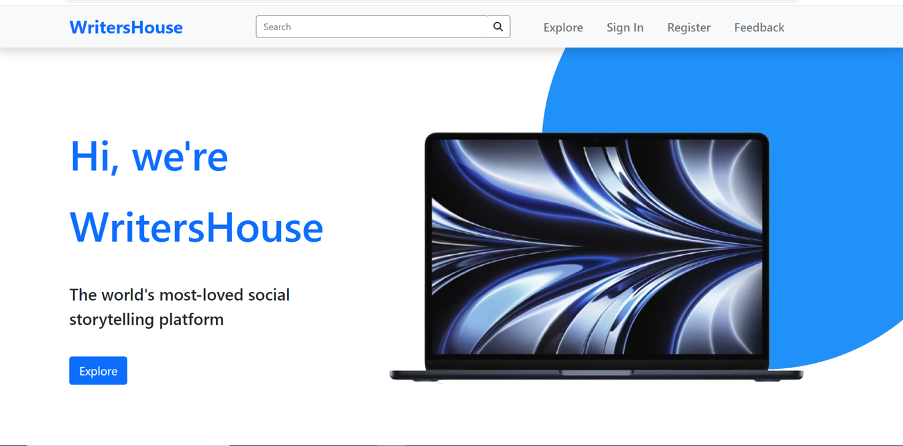
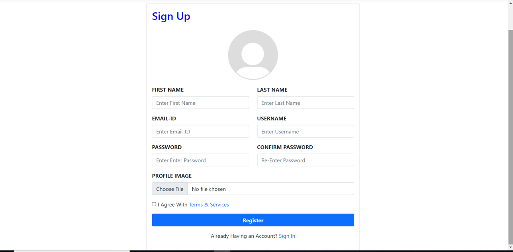
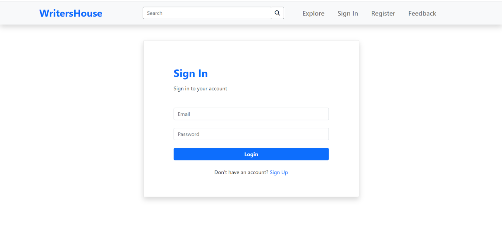
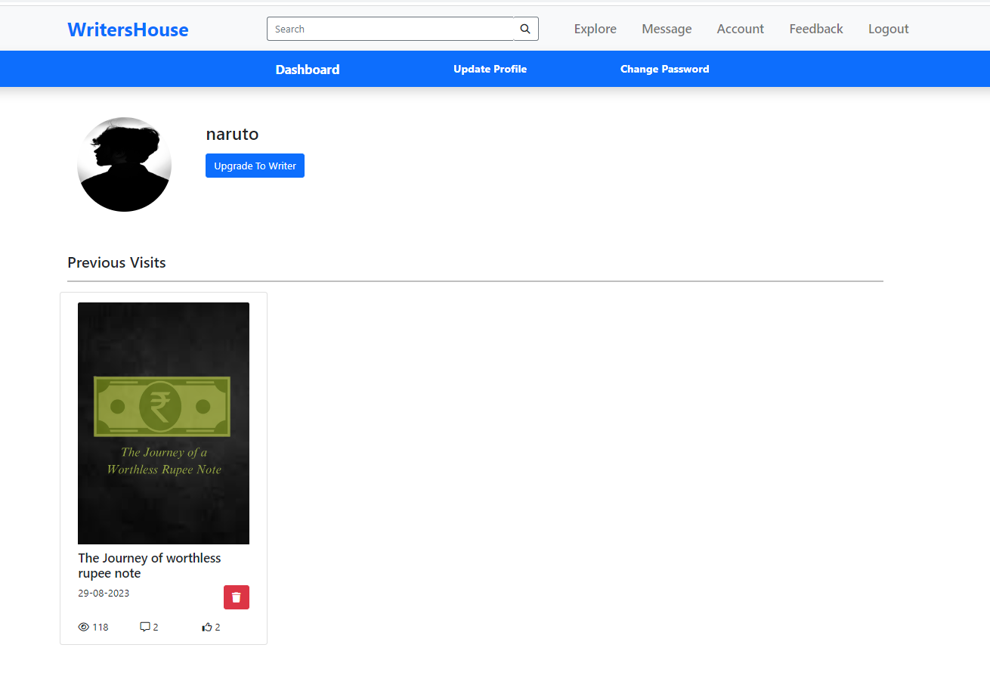
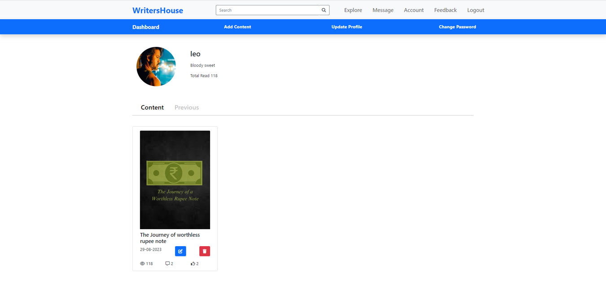
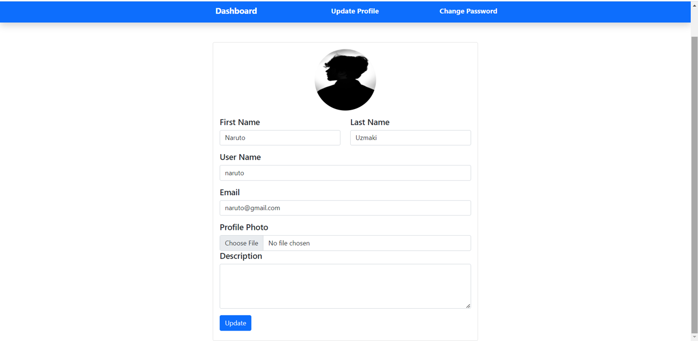

# WritersHouse

WritersHouse is an interactive storytelling platform designed to connect writers and readers. It provides a space for writers to showcase their literary work and for readers to explore and engage with various types of content. The platform includes features such as community interaction, content review, audio storytelling, and music integration.

## Index

1. [Features](#features)
2. [Setup and Running the Project](#setup-and-running-the-project)
3. [Project Build](#project-build)
4. [Screenshots](#screenshots)
5. [Conclusion](#conclusion)

## Features

- **Writing Showcase**: Allows writers to share their literary compositions, including short stories, essays, articles, and poetry.
- **Reading Others' Work**: Enables users to explore and comment on the works of their peers.
- **Community Interaction**: Facilitates one-to-one chat interactions between users and writers.
- **Reviewing Others' Content**: Provides a platform for users to review and critique works.
- **Audio Tools**: Offers features for listening to content, enhancing accessibility.
- **Music Tools**: Integrates music into the reading experience.
- **Search and Discovery**: Includes advanced search options for exploring content.
- **Feedback System**: Allows users to provide feedback visible only to administrators.
- **Enhanced User Interface (UI)**: Features a user-friendly design for easy navigation.

## Setup and Running the Project

To set up and run the WritersHouse platform locally, follow these steps:

1. **Clone the Repository**
   - Copy the repository to your local machine and place it in the `htdocs` folder of your XAMPP installation.

2. **Update Apache Configuration**
   - Open the `httpd.conf` file located in the `apache/conf` directory of your XAMPP installation.
   - Modify the `DocumentRoot` and `<Directory>` directives to point to the `Writers_House` folder:
     ```apache
     DocumentRoot "C:/xampp/htdocs/Writers_House"
     <Directory "C:/xampp/htdocs/Writers_House">
     ```
   - Save and close the file.

3. **Set Up the Database**
   - Start the XAMPP Control Panel and ensure the Apache and MySQL services are running.
   - Access phpMyAdmin by navigating to `http://localhost/phpmyadmin` in your web browser.
   - Create a new database named `writers_house`.
   - Import the SQL file located in the `sql/` folder into the `writers_house` database.

4. **Start the Platform**
   - Open your web browser and navigate to `http://localhost/Writers_House` to access the platform.

## Project Build

The platform is built using the Bootstrap framework for responsive design and user interface components. Ensure that Bootstrap CSS and JavaScript files are included in your project to maintain the expected appearance and functionality.

## Screenshots

<table>
  <tr>
    <td>
      
      <p align="center"><b>Home Page</b></p>
    </td>
    <td>
      
      <p align="center"><b>Registration Page</b></p>
    </td>
    <td>
      
      <p align="center"><b>Sign In Page</b></p>
    </td>
  </tr>
  <tr>
    <td>
      
      <p align="center"><b>User Dashboard</b></p>
    </td>
    <td>
      
      <p align="center"><b>Writer Dashboard</b></p>
    </td>
    <td>
      
      <p align="center"><b>Profile Update Page</b></p>
    </td>
  </tr>
</table>

## Conclusion

WritersHouse combines traditional storytelling with modern digital features to create a rich environment for writers and readers. By following the setup instructions, you can deploy the platform locally and explore its functionalities. Enjoy building and engaging with this dynamic storytelling platform!
